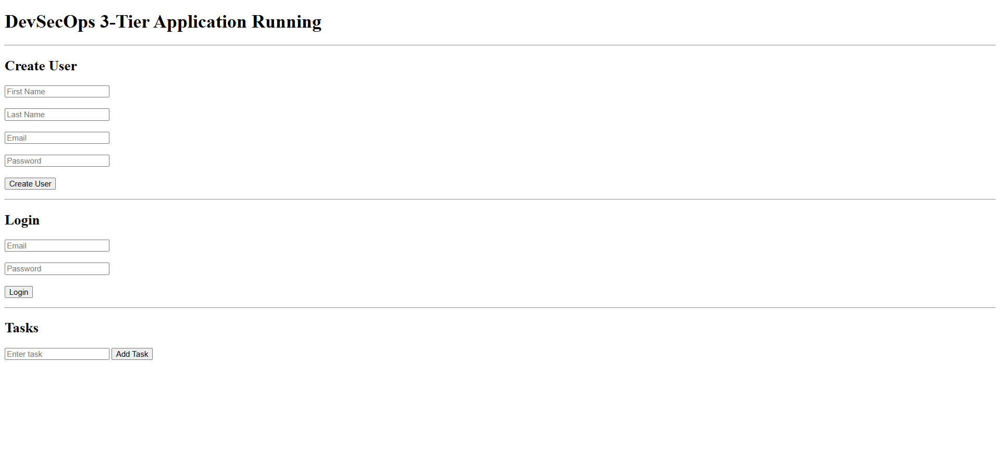

#  DevSecOps 3-Tier Application (Flask + Kubernetes + GitOps)


---


## 📌 Project Overview

This project demonstrates a **complete DevSecOps pipeline** for deploying a **3-tier application** using modern tools and best practices.

It includes:

* Backend: Flask API (authentication + task management)
* Database: PostgreSQL
* Containerization: Docker
* Orchestration: Kubernetes (Minikube)
* Packaging: Helm
* GitOps: ArgoCD
* Monitoring: Prometheus + Grafana
* Alerting: Alertmanager (Email notifications)
* CI/CD: Jenkins

---

## 🏗️ Architecture

```
User
  ↓
Nginx (Reverse Proxy)
  ↓
Flask Application (API + Metrics)
  ↓
PostgreSQL Database

Monitoring Stack:
Flask → Prometheus → Alertmanager → Email
                   ↓
                Grafana
```

---

## ⚙️ Tech Stack

| Category         | Tools Used                |
| ---------------- | ------------------------- |
| Backend          | Flask (Python)            |
| Database         | PostgreSQL                |
| Containerization | Docker, Docker Compose    |
| Orchestration    | Kubernetes (Minikube)     |
| Package Manager  | Helm                      |
| GitOps           | ArgoCD                    |
| Monitoring       | Prometheus                |
| Visualization    | Grafana                   |
| Alerting         | Alertmanager (Gmail SMTP) |
| CI/CD            | Jenkins                   |
| Security Scanning| Trivy                     |

---

## 🔐 Security (DevSecOps)

### 🔍 Trivy Image Scanning

Integrated **Trivy** in the CI/CD pipeline to scan Docker images for vulnerabilities.

* Scans for:

  * OS package vulnerabilities
  * Application dependencies
  * Misconfigurations

* Ensures only secure images are deployed to Kubernetes
---
### 🔁 Security Workflow

1. Jenkins builds Docker image
2. Trivy scans the image
3. If vulnerabilities found → build can be failed (configurable)
4. Secure image pushed to DockerHub
5. ArgoCD deploys only validated images

### 📌 Example Command

```bash
trivy image nirmalyavishal97/devsecops-flask-app:latest
```
---

## 🔁 DevOps Workflow

1. Developer pushes code to GitHub
2. Jenkins builds Docker image & pushes to DockerHub
3. Helm chart updated with new image tag
4. ArgoCD syncs Kubernetes cluster automatically
5. Application deployed to Kubernetes
6. Prometheus scrapes metrics
7. Alerts triggered via Alertmanager
8. Notifications sent via Email

---


## 🔄 GitOps (ArgoCD)

* Continuous deployment using ArgoCD
* Auto-sync enabled from GitHub repo
* Declarative Kubernetes deployments using Helm

---

## 📊 Monitoring & Alerting

### 🔹 Prometheus

* Scrapes custom metrics from Flask (`/metrics`)
* Tracks request count & CPU usage

### 🔹 Grafana

* Visual dashboards for:

  * CPU usage
  * Request metrics
  * Application health

### 🔹 Alertmanager

* Email alerts configured via Gmail SMTP
* Example alert:

  * **HighCPUUsage (>70%)**

---

## 📸 Screenshots

### 🖥️ Application UI



### 🔄 ArgoCD Sync


### 📊 Grafana Dashboard


### 🚨 Prometheus Alert Firing


### 📧 Email Alert


### ⚙️ Jenkins Pipeline


---

## 🛠️ Setup Instructions

### 🔹 Clone Repo

```bash
git clone https://github.com/<your-username>/DevSecOps-3Tier-K8s-GitOps-Project.git
cd DevSecOps-3Tier-K8s-GitOps-Project
```

---

### 🔹 Run Locally (Docker Compose)

```bash
docker-compose up --build
```

---

### 🔹 Kubernetes Deployment

```bash
# Apply Kubernetes manifests
kubectl apply -f kubernetes/

# OR using Helm
helm install flask-app ./helm/flask-app
```

---

### 🔹 Database Setup (Important)

```bash
export FLASK_APP=run.py

flask db init
flask db migrate -m "initial"
flask db upgrade
```

---

## 🔐 Security Considerations

* Environment variables used for secrets
* No hardcoded credentials in code
* JWT-based authentication implemented
* Ready for integration with:

  * Kubernetes Secrets
  * Vault (future enhancement)

---

## 🚀 Key Features

* 🔐 JWT Authentication
* 📋 Task Management API
* 📊 Custom Metrics Export (/metrics)
* 📦 Helm-based Deployment
* 🔄 GitOps with ArgoCD
* 📈 Monitoring & Alerting
* ⚙️ CI/CD Pipeline with Jenkins

---

## 🔮 Future Improvements

* Add HPA (Horizontal Pod Autoscaling)
* Integrate Kubernetes Secrets
* Add Ingress Controller (NGINX)
* Implement RBAC & Network Policies
* Add Tracing (Jaeger)
* Move to cloud (AWS / Azure)

---

## 👨‍💻 Author

**Nirmalya Das**
DevOps Engineer | Cloud | Kubernetes | CI/CD

---

## ⭐ If you like this project

Give it a ⭐ on GitHub and connect with me on LinkedIn!

---

